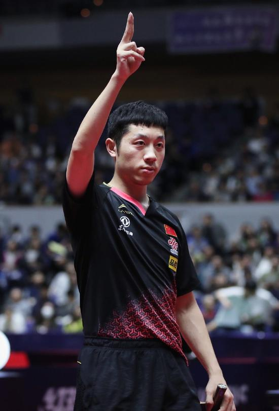

## 									许昕

#### 返回README：[README.md](README.md)

#### 图片：




许昕训练之余，也会打点代码，，

```c++
#include<bits/stdc++.h>
using namespace std;
long long int N,a[100005];
const int M = 100005,MOD = 1e9+7;
vector<int > tap[M];
long long int dp[M];
int st[M];

int main(){
    cin>>N;
    for(int i = 0 ; i < N ; i ++)   cin>>a[i];
    for(int i = 1 ; i < M ;i ++)//约束预处理
        for(int j = 2*i ; j < M ; j +=i){
            tap[j].push_back(i);
        }
    dp[0] = 1;
    for(int i = 1 ; i < N ; i ++){
        memset(st,0,sizeof(st));
        for(int j = i-1; j >= 0 ; j --){
            int d = a[i]-a[j],cnt = 0;
            for(int k = 0 ; k < tap[d].size() ; k ++){
                int v = tap[d][k];
                if(st[v] == 0){//st数组的作用需要理解一下
                    st[v] = 1;
                    cnt++;
                }
            }
            st[d] = 1;
            dp[i] = (dp[i]+(long long )dp[j]*cnt)%MOD;
        }
    }
    cout<<dp[N-1];
}
```


|  时间  |                  荣誉                  |
| :----: | :------------------------------------: |
|  2021  |   东京奥运会乒乓球混双银牌，男团冠军   |
|  2017  |   杜塞尔多夫世乒赛男双冠军及男单季军   |
|  2016  |        里约奥运会乒乓球男团冠军        |
|  2015  |       全锦赛男团、男单和男双三冠       |
|  2014  | 仁川亚运会男单冠军、男团冠军、男双亚军 |
| ...... |                 ......                 |


#### 外号：

1. 黄金左直
2. 大蟒
3. 国乒喜剧人
4. 人民艺术家


#### 搭档：

* 张继科
* 马龙
* 樊振东
* 刘诗雯


*斜体字*

**粗体字**

~~this text~~


---

**2011年，获得鹿特丹世乒赛男双冠军。 2012年，许昕在国际乒联职业巡回赛总决赛中夺得男单冠军，并在次年总决赛男单决赛中，以4-3战胜马龙。**

*2021年东京奥运会，男团冠军。*

---


> 2006年，许昕入选国家一队。2009年，全运会上与王励勤获得男双冠军。 2010年，广州亚运会获得混双、男团冠军及男双亚军。 

